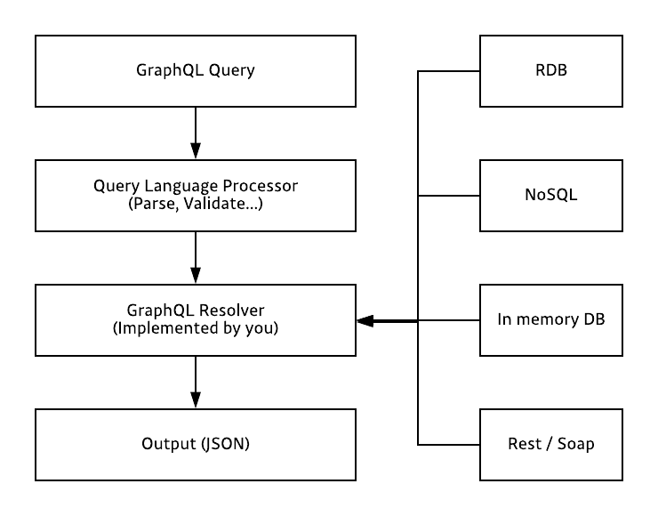
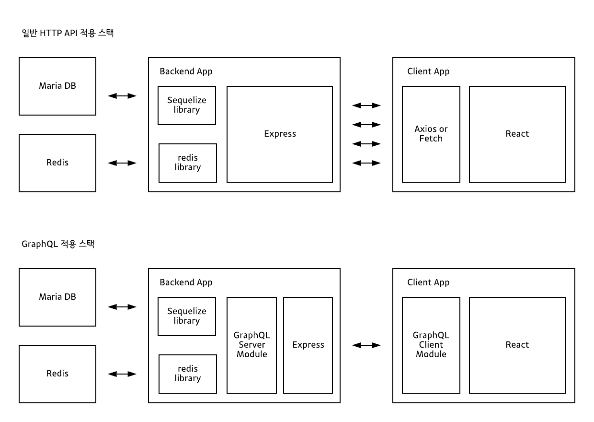

## GraphQL이란?

Graph QL(이하 gql)은 Structed Query Language(이하 sql)와 마찬가지로 쿼리 언어입니다. 이 둘은 애초에 탄생 시기도 다르고 배경도 다릅니다. sql은 **데이터베이스 시스템**에 저장된 데이터를 효율적으로 가져오는 것이 목적이고, gql은 **웹 클라이언트**가 데이터를 서버로 부터 효율적으로 가져오는 것이 목적입니다. sql의 문장(statement)은 주로 백앤드 시스템에서 작성하고 호출 하는 반면, gql의 문장은 주로 클라이언트 시스템에서 작성하고 호출 합니다.

sql쿼리 예시

```
SELECT id, name, sex, hobby FROM users;
```

graphql쿼리 예시

```
{
  users{
    id
    name
    sex
    hobby
  }
}
```

서버사이드 gql 어플리케이션은 gql로 작성된 쿼리를 입력으로 받아 쿼리를 처리한 결과를 다시 클라이언트로 돌려줍니다. HTTP API 자체가 특정 데이터베이스나 플렛폼에 종속적이지 않은것 처럼 마찬가지로 gql 역시 어떠한 특정 데이터베이스나 플렛폼에 종속적이지 않습니다.



## GraphQL or REST API

REST API는 URL, METHOD등을 조합하기 때문에 다양한 Endpoint가 존재 합니다. 반면, gql은 단 하나의 Endpoint가 존재 합니다. 또한, gql API에서는 불러오는 데이터의 종류를 쿼리 조합을 통해서 결정 합니다. 예를 들면, REST API에서는 각 Endpoint마다 데이터베이스 SQL 쿼리가 달라지는 반면, gql API는 gql 스키마의 타입마다 데이터베이스 SQL 쿼리가 달라집니다.



위 그림처럼, gql API를 사용하면 여러번 네트워크 호출을 할 필요 없이, 한번의 네트워크 호출로 처리 할 수 있습니다.


\[참조\][https://tech.kakao.com/2019/08/01/graphql-basic/](https://tech.kakao.com/2019/08/01/graphql-basic/)