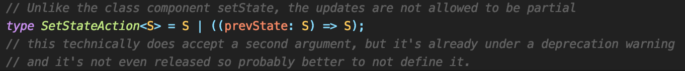

## 상태를 업데이트하는 방법

리액트에서 상태를 업데이트 할때 setState함수를 호출합니다. setState는 업데이트 할 부분을 포함하는 객체를 인자로 받고 state에 merge하는 방식으로 상태를 업데이트하는데요.

예시를 보고 설명드리겠습니다.
```tsx
const TestPage = () => {
  const [state, setState] = useState(3);
  const add = () => setState(state + 1);
  const multiply = () => setState(state * 2);
  const multiplyAndAdd = () => {
    multiply();
    add();
  };
  return (
    <TestWrap>
      <div>{state}</div>
      <button onClick={add}>Add</button>
      <button onClick={multiply}>Multiply</button>
      <button onClick={multiplyAndAdd}>MultiplyAndAdd</button>
    </TestWrap>
  );
};
```

1.  Add button Click : 4
2.  Multiply button Click : 6
3.  MultiplyAndAdd button Click : 4

결과를 보면 setState를 연속적으로 사용해도 마지막 setState만 실행되는 것처럼 보여집니다.

## setState의 특성

1.  setState는 비동기적으로 처리된다.
2.  setState를 연속적으로 호출하면 batch처리를 한다.

만약 setState를 호출한 횟수만큼 렌더링이 일어나면 성능이슈가 발생할 수 있습니다.   
그래서 리액트는 setState가 연속적으로 호출되면 한번의 setState만 처리해 호출할 때마다 렌더링이 일어나지 않도록 batch처리를 합니다.   

```tsx
  const newState = Object.assign({ number: 6 }, { number: 4 });
```

Object.assign과 같이 여러 개의 객체를 합칠 때 같은 key를 가지고 있다면 하나의 key: value쌍만 적용되기 때문에 마지막 object인 number: 4만 적용됩니다.

## 그렇다면 우리가 원하는 값인 3 \* 2 + 1 = 7의 결과를 얻기 위해선 어떻게 해야할까?



리액트의 setState는 인자로 두 가지 타입을 받을 수 있습니다.

1.  새로운 state
2.  prevState 객체를 인자를 받아 새로운 state를 반환하는 함수

## 함수형setState

setState가 비동기적으로 동작함은 변함없지만 인자로 받은 함수들은 queue에 저장되어 순서대로 실행됩니다.   
리액트는 queue의 각 함수를 호출하여 상태를 업데이트하고 함수 파라미터로 함수형 setState 호출 이전 상태를 전달합니다.  

함수형 setState의 특성을 이용해 소스를 수정해보겠습니다.

```tsx
const TestPage = () => {
  const [state, setState] = useState<number>(3);
  const add = () => setState(state => state + 1);
  const multiply = () => setState(state => state * 2);
  const multiplyAndAdd = () => {
    multiply();
    add();
  };
  return (
    <TestWrap>
      <div>{state}</div>
      <button onClick={add}>Add</button>
      <button onClick={multiply}>Multiply</button>
      <button onClick={multiplyAndAdd}>MultiplyAndAdd</button>
    </TestWrap>
  );
};
```

1.  Add button Click : 4
2.  Multiply button Click : 6
3.  MultiplyAndAdd button Click : 7

## 정리
리액트에서 가장 자주 사용하는 setState이지만 제공되는 인터페이스를 어떻게 사용하느냐에 따라 다른 결과를 도출할 수 있습니다.
setState뿐만 아니라 인터페이스의 내부 매커니즘을 이해하고 사용한다면 더 정확한 로직을 작성할 수 있을 것 같습니다.