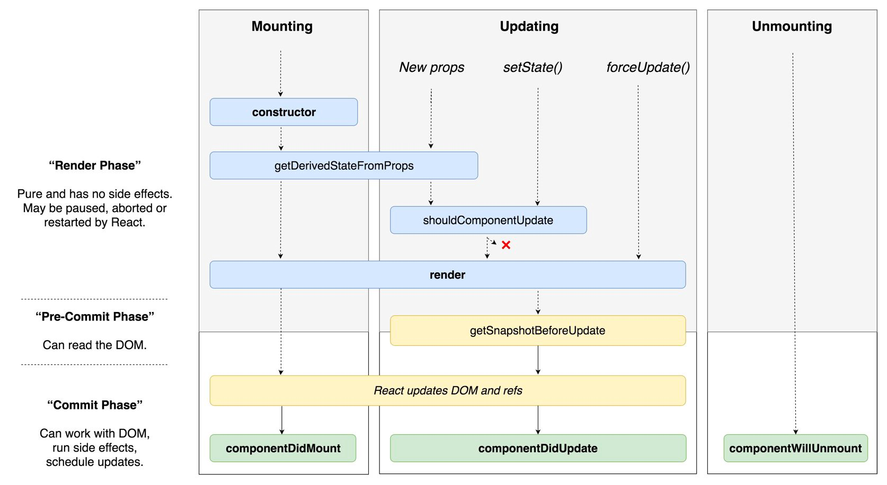

# React 렌더링 성능 최적화



리액트는 컴포넌트의 prop, state가 변경되면 컴포넌트 함수를 실행해 화면을 렌더링합니다.

여기서 **shouldComponentUpdate** 단계에 집중해보겠습니다.   
이 단계에서 리액트는 렌더링이 필요하다고 판단되면 컴포넌트 함수를 실행시키고 가상 돔 비교를 통해 변경점을 찾아 실제 돔에 반영합니다.   
이 단계를 잘 활용해 리액트에서 렌더링 성능 최적화하는 방법들을 알아보겠습니다.

### memo로 렌더링 결과 재사용하기
memo함수로 감싼 컴포넌트는 실행되기 전에 prop비교 함수가 호출됩니다. 이전 prop과 비교해 변경점이 있다면 컴포넌트 함수를 실행해서 가상돔을 업데이트 하고 그렇지 않으면 함수 실행을 하지 않습니다.   
memo를 사용하지 않는다면 prop이 변경되지 않아도 부모 컴포넌트가 실행될 때 자식 컴포넌트도 같이 실행됩니다.   
대부분의 경우 리액트에서 Virtual DOM을 이용해 실제 돔을 변경하지 않아 문제가 되지 않지만, 성능이 중요한 상황에서는 memo를 이용해 불필요한 함수실행을 막아 연산량을 줄일 수 있을 것입니다.

memo 예시
```tsx
import { memo } from 'react';

function App({title, description}) {
  return (
    <div>
      <h1>{title}</h1>
      <p>{description}</p>
    </div>
  )
};

export default memo(App);
```

### memo를 사용해도 렌더링이 발생하는 경우
버튼을 눌러서 toggle 상태를 변경하면 렌더링이 시작됩니다. 여기서 SelectCar 에서 memo를 사용해 SelectCar 컴포넌트는 호출되지 않는다고 생각할 수 있는데요.   
예상과는 다르게 SelectCar 컴포넌트 함수는 호출되게 됩니다. 이유가 뭘까요?   
바로 SelectCar가 전달받은 onChange 함수가 변경되기 때문입니다. Parent 컴포넌트가 렌더링 될 때마다 새로운 함수가 자식 컴포넌트의 prop으로 주입되어 자식 컴포넌트 입장에서는 prop이 변경되었다고 인식하게 됩니다.

```tsx
import { memo } from 'react';

const SelectCar = memo(({selected, onChange}) => {
    return(
        <MySelectBox
            options={['bmw', 'benz', 'audi']}
            selected={selected}
            onChange={onChange}
        />
    )
})

function Parent(){
    const [selectedCar, setSelecetedCar] = useState('bmw');
    const [toggle, setToggle] = useState(0);
    return(
        <div>
            <div>{toggle}</div>
            <button onClick={() => setToggle(toggle => toggle + 1)}>Toggle</button>
            <SelectCar
                selected={selectedCar}
                onChange={(newSelectedCar) => setSelecetedCar(newSelectedCar)}
            />
        </div>
    )
}
```

다음과 같이 작성하면 onChange 속성값은 항상 같은 값이 입력됩니다.
useState, useReducer의 변경 함수는 불변변수인 점을 이용하면 문제를 쉽게 해결할 수 있습니다.
```tsx
function Parent(){
    const [selectedCar, setSelecetedCar] = useState('bmw');
    const [toggle, setToggle] = useState(0);
    return(
        <div>
            <div>{toggle}</div>
            <button onClick={() => setToggle(toggle => toggle + 1)}>Toggle</button>
            <SelectCar
                selected={selectedCar}
                onChange={setSelecetedCar}
            />
        </div>
    )
}
```
### useCallback 을 이용하기
그렇다면 직접 작성한 함수는 어떻게 처리해야 할까요?
```tsx
function Parent(){
    const [selectedCar, setSelecetedCar] = useState('bmw');
    const [toggle, setToggle] = useState(0);
    
    const onChangeSelectedCar = useCallback((newSelectedCar) => {
        setSelecetedCar(newSelectedCar)
        console.log(newSelectedCar);
    }, [])
    
    return(
        <div>
            <div>{toggle}</div>
            <button onClick={() => setToggle(toggle => !toggle)}>Toggle</button>
            <SelectCar selected={selectedCar} onChange={onChangeSelectedCar} />
        </div>
    )
}
```
위와 같이 useCallback 훅을 이용해 함수를 구현할 수 있습니다. 의존성 배열로 빈 배열을 입력해 컴포넌트가 처음 마운트된 시점에 생긴 함수를 지속해서 사용하게 됩니다.

### 객체의 값이 변하지 않도록 관리하기
함수와 마찬가지로 컴포넌트 내부에서 객체를 정의해 자식 컴포넌트 props로 넘겨주면 렌더링 될 대마다 새로운 객체를 만들어 전달하게 됩니다.
```tsx
const SelectCar = React.memo(({selected, onChange}) => {
    return (
        <MySelectBox
            options={['bmw', 'benz', 'audi']}
            selected={selected}
            onChange={onChange}
        />
    )
})
```
options prop이 상수값이라면 컴포넌트 외부에서 따로 정의해 관리하는 것이 좋을 수 있습니다.   
이렇게 되면 MY_CARS 배열은 렌더링과 무관하게 항상 같은 값을 가지게 되어 prop으로 항상 동일한 값을 전달하게 됩니다.
```tsx
const MY_CARS = ['bmw', 'benz', 'audi']

const SelectCar = React.memo(({selected, onChange}) => {
    return(
        <MySelectBox
            options={MY_CARS}
            selected={selected}
            onChange={onChange}
        />
    )
})
```

### useMemo 를 이용하기
아래와 같이 특정 조건에 따라 다른 값을 사용하는 경우에는 상수로 관리할 수 없습니다.
```tsx
const MY_CARS = [{name: 'bmw', price: 5000}, {name: 'benz', price: 6000}, {name: 'audi', price: 4500}]

const SelectCar = React.memo(({selected, onChange, maxPrice}) => {
    return(
        <MySelectBox
            options={MY_CARS.filter(car => car.price <= maxPrice)}
            selected={selected}
            onChange={onChange}
        />
    )
})
```

이런 상황에선 useMemo 를 이용해 maxPrice 가 바꼈을 때만 options 의 값이 변경되도록 만들 수 있습니다.
```tsx
const MY_CARS = [
    {name: 'bmw', price: 5000},
    {name: 'benz', price: 6000},
    {name: 'audi', price: 4500}
];

const SelectCar = React.memo(({selected, onChange, maxPrice}) => {
    const options = useMemo(() => MY_CARS.filter(car => car.price <= maxPrice), [maxPrice])
    return(
        <MySelectBox
            options={options}
            selected={selected}
            onChange={onChange}
        />
    )
})
```

## 마무리
이렇게 memo, useCallback, useMemo 를 사용해 렌더링 최적화 하는 방법을 살펴봤습니다. 그렇다면 항상 렌더링 최적화를 진행하는 것이 좋을까요?   
너무 잦은 최적화는 생산성을 떨어트릴 뿐만 아니라 코드의 가독성 또한 떨어트릴 수 있습니다. 또한 최적화 함수를 사용해 비교 연산을 하는 것도 비용이기 때문에 성능 이슈가 생겼을 때 해당하는 부분의 코드를 최적화하는게 좋을 것 같습니다.
