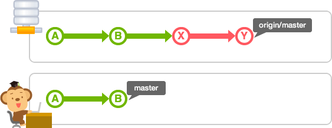

git pull(가져와 병합하기): git remote 명령을 통해 서로 연결된 원격 저장소의 최신 내용을 로컬 저장소로 가져오면서 병합한다. git push의 반대라고 생각하면 된다.

git fetch(가져오기): 로컬 저장소와 원격저장소의 변경사항을 다를 때 이를 비교하고 git merge 명령어와 함께 최신 데이터를 반영하거나 충돌문제 등을 해결한다.

### Pull

그림과 같이 로컬 저장소의 모든 변경 사항이 반영되어 있는 상태에서 새로운 변경 사항이 있는 원격 저장소의 커밋 Y 를 로컬로 가져오는 경우

;

git pull을 하게 되면 'fast-forward병합'이 이루어진다. 그림 속의 'master'는 로컬저장소의 'master' 브랜치, 'origin/master'는 원격 저장소 'origin'의 'master' 브랜치.

;

로컬 저장소의 'master'브랜치에서고 변경 사항이 있을 때 양 쪽의 변경을 통합할 필요가 있다. 이 때 pull을 실행하여 소스를 병합할 수 있는데 충돌이 있을 경우 수동으로 해결한 다음 직접 commit을 해주어야함

### Fetch

pull 을 실행하면, 원격 저장소의 내용을 가져와 자동으로 병합 작업을 실행하지만, 단순히 원격 저장소의 내용을 확인만 하고 로컬 데이터와 병합은 하고 싶지 않은 경우에는 fetch 명령어를 사용할 수 있다. fetch 를 실행하면, 원격 저장소의 최신 이력을 확인할 수 있는데 이 때 가져온 최신 커밋 이력은 이름 없는 브랜치로 로컬에 가져오게 되며 이 브랜치는 'FETCH\_HEAD'의 이름으로 체크아웃 할 수도 있다.

;

원격 저장소의 내용을 로컬 저장소의 'master'에 통합하고 싶은 경우에는, 'FETCH\_HEAD' 브랜치를 merge 하거나 다시 pull 을 실행하면 된다.

fetch 이후 merge를 수행하면 pull을 실행했을 때와 같은 결과가 생성되기 때문에 pull = fetch + merge 라고 볼 수 있다.