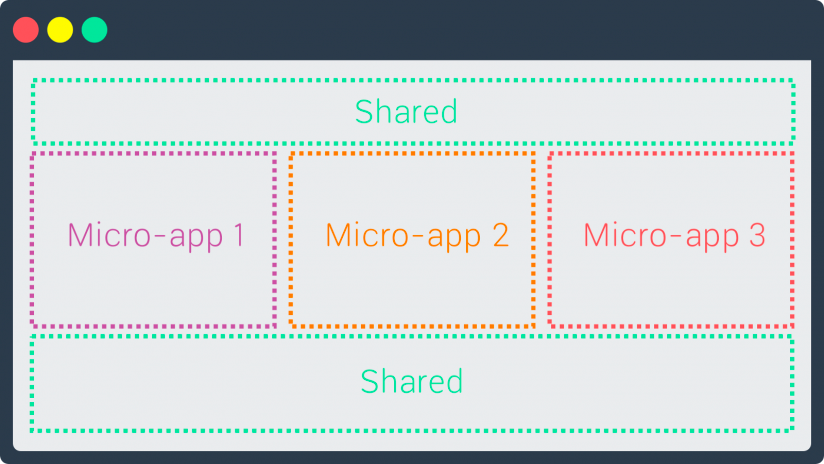

# Micro Frontend Architecture

## Micro Frontend란?
서비스 규모가 커질수록 복잡해진 의존성으로 인해 작은 변경에도 영향 범위가 커질 수 있고 예측하기 어려워집니다. 팀규모가 커지면서 팀간 의사소통 비용이 증가해 업무 결합도가 높아지는 문제가 발생할 수 있는데요.
이러한 상황에 우리는 마이크로 서비스를 떠올릴 수 있습니다. 프론트엔드 개발에도 마이크로 서비스를 적용한게 마이크로 프론트엔드입니다.

    <h3>"서로 다른 어플리케이션을 조합해 하나의 통합된 어플리케이션을 만드는 설계 방법"</h3>

#### 장점
- 작고, 응집력 있는 코드베이스를 가져 유지보수에 용이하다.
- 독립적인 유지보수, 배포가 가능해 업무 의존도를 줄여 팀 운영이 수월해진다. 
- 시간이 지남에 따라 특정 서비스가 복잡해지면 더 작은 단위로 분리할 수 있다.

#### 단점
- 배포 번들 사이즈가 커질 수 있다.
- 개발 환경의 차이로 복잡도가 증가한다.
- 독립적인 빌드, 배포 프로세스를 가져 운영 비용이 증가한다.

## MartinFowler가 제시한 MFA 구현방법 5가지

#### 1. 서버 템플릿 통합
- 각 서버로 html 템플릿을 요청하고, 최종 응답서버에서 각 템플릿을 조합해서 응답을 보낸다.
- 서버측에서 최종 화면을 조합한다.

#### 2. 빌드타임 통합
- 애플리케이션을 패키지로 배포하고, 컨테이너 애플리케이션에서 import하여 사용하는 방법
- 릴리즈 후 최종 애플리케이션에서 컴파일해야 한다.

#### 3. iframe 통합
- 애플리케이션 통합의 유연성이 높다.
- 애플리케이션간 기술 종속성이 없다.
- history 객체를 각각 가져 routing 관련한 이슈가 복잡해 질 수 있다.
- 애플리케이션간 통신에 제약이 있다.
- iframe안에 갇히기 때문에 어색한 UX를 가질 수 있다.

#### 4. Javascript를 통한 런타임 통합
- iframe과 달리 유연한 통합이 가능하다.
- 컨테이너 애플리케이션이 단위 애플리케이션 번들을 페치한다.
- 클라이언트(브라우저)측에서 통합한다.

#### 5. Web Components를 통한 통합
- Javascript를 통한 런타임 통합과 유사하지만 "The web component way"를 지향한다.
- 클라이언트측에서 (브라우져) 통합한다.
> web component에 이해도가 낮아 정확한 정보가 아닐 수 있습니다.

## 도입시 주의사항

#### Styling
각 애플리케이션은 독립적으로 개발되고 배포되기 때문에, 스타일링 방식이 다를 수 있습니다. 
CSS in JS, CSS Modules 을 사용해 스타일링 방식을 독립적으로 유지할 수 있지만 각 서비스마다 스타일링을 한다면 UI 일관성이 깨져 사용자 경험이 떨어질 수 있고 유지보수비용 또한 증가할 수 있습니다.
애플리케이션간 UI 일관성을 위해 컴포넌트 라이브러리를 개발하여 재사용성을 확보하는게 좋은 방법일 수 있습니다.

#### 애플리케이션간 커뮤니케이션
가능한 애플리케이션간 메세지를 주고받지 않는게 좋으며 필요하다면, custom-event 또는 url routing을 통해 메세지를 주고받을 수 있습니다.

#### Performance
애플리케이션간 중복된 의존성을 가지고 있는 경우 파일 사이즈 증가로 인해 네트워크 성능이 저하될 수 있습니다.   
만약 애플리케이션을 lazy하게 로드한다면 사용자가 애플리케이션을 처음 실행하기까지 시간이 걸릴 수 있습니다.

#### 운영 복잡도
애플리케이션마다 다른 빌드, 배포 파이프라인을 가지게 되어 운영 복잡도가 증가할 수 있습니다. 따라서 소규모 팀인 경우 개발 비용을 고려해 도입해야합니다.

#### 참고
- [https://martinfowler.com/articles/micro-frontends.html](https://martinfowler.com/articles/micro-frontends.html)