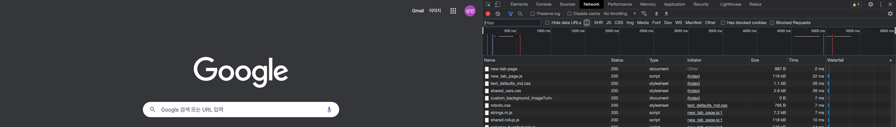

# 브라우저 렌더링 과정


1. 브라우저는 HTML, CSS, JavaScript, Image, Font file 등 렌더링에 필요한 리소스를 요청하고 서버로부터 응답을 받는다.
2. 브라우저의 렌더링 엔진은 서버로부터 응답된 HTML과 CSS를 파싱하여 DOM과 CSSOM을 생성하고 이들을 결합하여 렌더 트리를 생성한다.
3. 브라우저의 자바스크립트 엔진은 서버로부터 응답된 자바스크립트를 파싱하여 AST(Abstract Syntax Tree)를 생성하고 바이트코드로 변환하여 실행한다.
이때 자바스크립트는 DOM API를 통해 DOM이나 CSSOM을 변경할 수 있다. 변경된 DOM과 CSSDOM은 다시 렌더 트리로 결합된다.
4. 렌더 트리를 기반으로 HTML 레이아웃(위치와 크기)을 계산하고 브라우저 화면에 HTML 요소를 페인팅한다.

## 요청과 응답

브라우저의 핵심 기능은 필요한 리소스를 서버에 요청하고 응답받아 브라우저에 시각적으로 렌더링하는 것이다.   
예를 들어 www.naver.com URL을 입력하고 엔터 키를 누르면 일반적으로 서버는 요청에 대해 암묵적으로 index.html을 응답하도록 기본 설정되어 있다.   
즉 www.naver.com 은 www.naver.com/index.html과 같은 요청이다.



www.naver.com 서버에 요청한 내용과 응답한 내용을 Network 패널에서 확인할 수 있다.   
그림을 자세히 살펴보면 document 파일뿐만 아니라 css, javascript, image, font 파일 등이 응답된 것을 확인할 수 있다.   
요청도 하지 않은 리소스들은 어떻게 응답된걸까?   
이는 브라우저의 렌더링 엔진이 index.html을 파싱하는 도중에 외부 리소스를 로드하는 태그,   
즉 link tag, img tag, script tag 등을 만나면 HTML의 파싱을 일시 중단하고 해당 리소스 파일을 서버로 요청하기 때문이다. 

## HTML 파싱과 DOM 생성

HTML문서는 문자열로 이루어진 순수한 텍스트다. 이 텍스트를 브라우저에 시각적인 픽셀로 렌더링하려면 HTML문서를 브라우저가 이해할 수 있는 자료구조(객체)로 변환하여 메모리에 저장해야 한다.


예를 들어 다음과 같은 HTML문서가 있다고 가정해보자.
```html
<!doctype html>
<html lang="en">
<head>
    <meta charset="UTF-8">
    <link rel="stylesheet" href="style.css">
    <title>Document</title>
</head>
<body>
  
</body>
</html>
```

브라우저의 렌더링 엔진은 HTML문서를 파싱하여 브라우저가 이해할 수 있는 자료구조인 DOM(Document Object Model)을 생성한다.

1. 서버에 존재하던 HTML파일을 브라우저 요청에 의해 응답한다.
2. 브라우저는 바이트(2진수) 형태로 응답된 HTML 문서를 meta 태그의 charset attribute에 의해 지정된 인코딩방식(ex) UTF-8)을 기준으로 문자열로 변환된다.
3. 문자열로 변환된 HTML 문서를 읽어 문법적 의미를 가지는 코드의 최소 단위인 token들로 분해한다.
4. 각 토큰들을 객체로 변환하여 node들을 생성핟나. 토큰의 내용에 따라 문서노드, 요소노드, 어트리뷰트노드, 텍스트노드가 생성되고 node는 이후 DOM을 구성하는 기본요소가 된다.
5. HTML 문서는 요소들의 집합으로 이루어지며 요소 간의 모든 노드들을 트리 자료구조로 구성한다. 이 노드들로 구성된 트리 자료구조를 DOM(Document Object Model)이라 부른다.
   
> 바이트   
>   >   ```1011010001011```
> 
> 문자
>   > ```<html lang="en"><head><meta charset="UTF-8"><link rel="stylesheet" href="style.css">...</html>```
>
> 토큰
>   >   ```{ startTag: 'html', contents: { startTag: 'head', contents: {...}, endTag: 'html' }```
> 
> 노드
>   > ```html, head, meta, link. body```
> 
> DOM

## CSS 파싱과 CSSOM 생성

렌더링 엔진은 HTML 순차적으로 파싱하여 DOM을 생성해 나간다. DOM을 생성해 나가던 중 CSS를 로드하는 link 태그나 style태그를 만나면 DOM 생성을 중단한다.   
link 태그의 href 어트리뷰트에 지정된 css파일을 요청해 로드한 css파일이나 style태그 내의 css를 HTML과 동일한 파싱과정(바이트 -> 문자 -> 토큰 -> 노드 -> CSSOM)을 거치며 CSSOM(Css Object Model)을 생성한다.
이후 HTML파싱이 중단된 지점부터 다시 HTML을 파싱하기 시작하여 DOM 생성을 재개한다.

## 렌더 트리 생성

렌더링 엔진은 DOM과 CSSOM을 렌더링을 위해 렌더 트리(render tree)로 결합한다.
렌더 트리는 렌더링을 위한 트리 구조의 자료구조이다. 따라서 렌더링되지 않는 노드(ex) meta, script, display:none)되는 노드들은 포함하지 않는다.


이후 완성된 렌더 트리는 HTML 요소의 레이아웃을 계산하는데 사용되며 브라우저 화면에 픽셀을 렌더링하는 페인팅 처리에 입력된다.
```
HTML -> DOM Tree
CSS -> CSSOM Tree

merge(DOM Tree, CSSOM Tree) 
-> Render Tree
-> Layout
-> Paint
```

## 리플로우와 리페인트

지금까지의 브라우저의 렌더링 과정은 반복해서 실행될 수 있다.
- 자바스크립트에 의한 노드 추가 또는 삭제
- 브라우저 창의 리사이징에 의한 viewport 크기 변경
- HTML 요소의 레이아웃(위치, 크기)에 변경을 발생시키는 width/height, margin/padding, border, display, position 등의 스타일 변경

```레이아웃 계산과 페인팅을 다시 실행하는 리렌더링은 비용이 많이 드는, 성능에 악영향을 주는 작업이다.```
